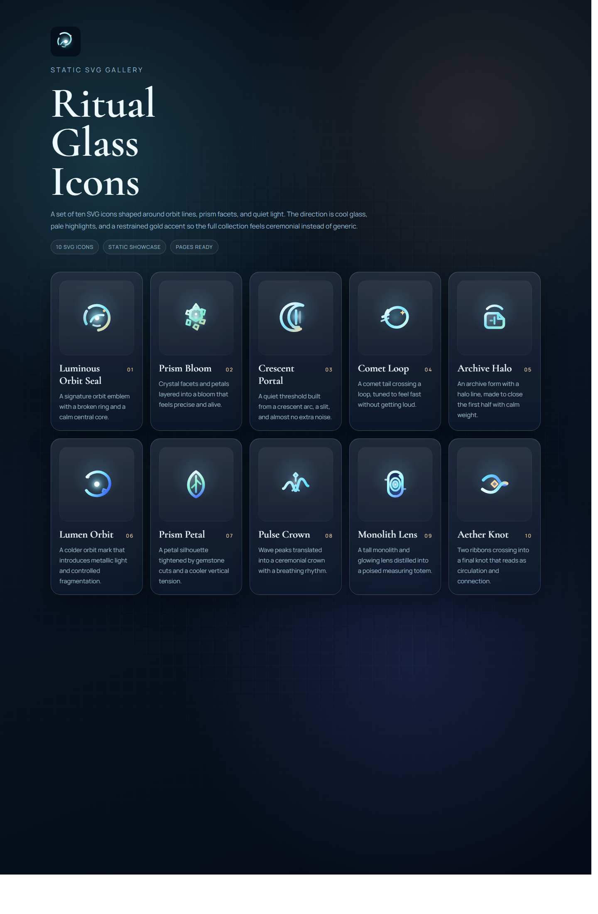
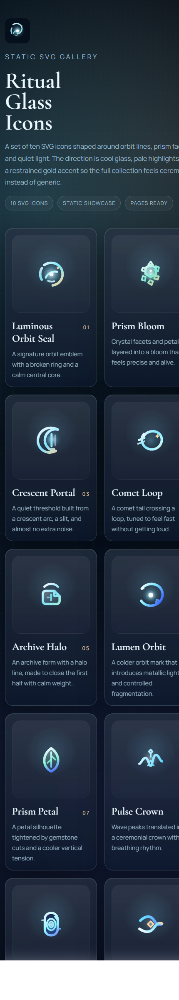

<div align="center">
  
  <h1>Ritual Glass Icons</h1>
  <p>
    軌道、プリズム、光輪、静かな発光をテーマにした 10 個の SVG アイコン集です。<br />
    ビルド不要の静的ショーケースとして動き、GitHub Pages と CI へそのまま載せられる形まで整えています。
  </p>
</div>

<p align="center">
  <a href="./README.md"><strong>English</strong></a>
</p>

<p align="center">
  
  
  
  
</p>

<p align="center">
  
</p>

## ✨ 概要
このリポジトリは、10 個の装飾的な SVG アイコンと、それらをまとめて確認できる静的ギャラリーページを同梱しています。方向性はあえて絞っており、冷たいガラス調グラデーション、乳白のハイライト、淡い金色の差し色、そして儀式的なインターフェースの空気感を一貫して保っています。

規模は小さく保ちつつ、公開向けの完成度は落とさない方針です。別の docs 基盤は増やさず、英日 README、静的サイト、軽量な機械検証に価値を集中させています。

## 🚀 まず試す
`uv` でローカルサーバーを立てて、ブラウザでギャラリーを開きます。

```powershell
uv run python -m http.server 4173
```

その後 `http://127.0.0.1:4173` を開いてください。

## 🖼️ 確認画像
### Desktop check


### Mobile check


## 🧩 アイコン一覧
| No. | 名称 | ファイル |
| --- | --- | --- |
| 01 | Luminous Orbit Seal | [`icons/01-luminous-orbit-seal.svg`](./icons/01-luminous-orbit-seal.svg) |
| 02 | Prism Bloom | [`icons/02-prism-bloom.svg`](./icons/02-prism-bloom.svg) |
| 03 | Crescent Portal | [`icons/03-crescent-portal.svg`](./icons/03-crescent-portal.svg) |
| 04 | Comet Loop | [`icons/04-comet-loop.svg`](./icons/04-comet-loop.svg) |
| 05 | Archive Halo | [`icons/05-archive-halo.svg`](./icons/05-archive-halo.svg) |
| 06 | Lumen Orbit | [`icons/06-lumen-orbit.svg`](./icons/06-lumen-orbit.svg) |
| 07 | Prism Petal | [`icons/07-prism-petal.svg`](./icons/07-prism-petal.svg) |
| 08 | Pulse Crown | [`icons/08-pulse-crown.svg`](./icons/08-pulse-crown.svg) |
| 09 | Monolith Lens | [`icons/09-monolith-lens.svg`](./icons/09-monolith-lens.svg) |
| 10 | Aether Knot | [`icons/10-aether-knot.svg`](./icons/10-aether-knot.svg) |

## 🛠️ リポジトリ構成
```text
.
|-- .github/workflows/
|-- assets/
|   |-- checks/
|   |-- favicon.svg
|   |-- ritual-glass-hero.svg
|   `-- ritual-glass-mark.svg
|-- icons/
|-- scripts/
|   |-- stage-pages.ps1
|   `-- validate-site.mjs
|-- index.html
|-- LICENSE
|-- README.ja.md
|-- README.md
|-- robots.txt
`-- site.webmanifest
```

## ✅ 検証
CI とローカル確認の両方で使える、軽量な検証スクリプトを同梱しています。

```powershell
node .\scripts\validate-site.mjs
```

このバリデータでは次を確認します。

- `index.html` に必要なメタデータがあること
- 10 個の SVG がすべて存在し、`viewBox` を持つこと
- ショーケースが 10 個のアイコンを 1 回ずつ参照していること
- 英日 README の言語切替リンクが相互に張られていること
- Pages 用の資産とワークフローが存在すること

## 📝 補足
- `index.html` ではエディトリアルなタイポグラフィのために Google Fonts を読み込んでいます。
- Pages ワークフローはビルドツールではなく、ルートの静的サイトをステージングして配信する方式です。
- ブラウザ確認用スクリーンショットは [`assets/checks`](./assets/checks) にまとめています。

## 📄 ライセンス
このプロジェクトは [`MIT License`](./LICENSE) で公開しています。
