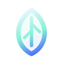

<div align="center">
  
  <h1>Ritual Glass Icons</h1>
  <p>
    Ten premium SVG icons built around orbit lines, prism facets, halos, and quiet light.<br />
    The repository ships as a zero-build static showcase with GitHub Pages and CI-ready validation.
  </p>
</div>

<p align="center">
  <a href="./README.ja.md"><strong>日本語</strong></a>
</p>

<p align="center">
  
  
  
  
</p>

<p align="center">
  
</p>

> This repository is an experiment repo for the Codex `frontend-design` skill.  
> The SVG designs in this collection were created with that skill.

## ✨ Overview
This repository packages a curated set of ten decorative SVG icons and a static gallery page for browsing them in one place. The visual direction stays intentionally narrow: cool glass gradients, pale highlights, gentle gold accents, and a ceremonial interface mood.

The project is small on purpose. Instead of adding a separate docs stack, the repository focuses on strong bilingual READMEs, a polished static site, and lightweight mechanical validation.

## 🚀 Quick Start
Serve the project locally with `uv` and open the gallery in your browser.

```powershell
uv run python -m http.server 4173
```

Then visit `http://127.0.0.1:4173`.

## 🖼️ SVG Preview
<p align="center">
  
  
  
  
  
</p>

<p align="center">
  
  
  
  
  
</p>

<p align="center">
  <sub>The README renders the original SVG assets directly. Browser verification screenshots are still available in <code>assets/checks/</code>.</sub>
</p>

## 🧩 Icon Set
| No. | Name | File |
| --- | --- | --- |
| 01 | Luminous Orbit Seal | [`icons/01-luminous-orbit-seal.svg`](./icons/01-luminous-orbit-seal.svg) |
| 02 | Prism Bloom | [`icons/02-prism-bloom.svg`](./icons/02-prism-bloom.svg) |
| 03 | Crescent Portal | [`icons/03-crescent-portal.svg`](./icons/03-crescent-portal.svg) |
| 04 | Comet Loop | [`icons/04-comet-loop.svg`](./icons/04-comet-loop.svg) |
| 05 | Archive Halo | [`icons/05-archive-halo.svg`](./icons/05-archive-halo.svg) |
| 06 | Lumen Orbit | [`icons/06-lumen-orbit.svg`](./icons/06-lumen-orbit.svg) |
| 07 | Prism Petal | [`icons/07-prism-petal.svg`](./icons/07-prism-petal.svg) |
| 08 | Pulse Crown | [`icons/08-pulse-crown.svg`](./icons/08-pulse-crown.svg) |
| 09 | Monolith Lens | [`icons/09-monolith-lens.svg`](./icons/09-monolith-lens.svg) |
| 10 | Aether Knot | [`icons/10-aether-knot.svg`](./icons/10-aether-knot.svg) |

## 🛠️ Repository Layout
```text
.
|-- .github/workflows/
|-- assets/
|   |-- checks/
|   |-- favicon.svg
|   |-- ritual-glass-hero.svg
|   `-- ritual-glass-mark.svg
|-- icons/
|-- scripts/
|   |-- stage-pages.ps1
|   `-- validate-site.mjs
|-- index.html
|-- LICENSE
|-- README.ja.md
|-- README.md
|-- robots.txt
`-- site.webmanifest
```

## ✅ Verification
The repository includes a lightweight validation path for CI and local checks.

```powershell
node .\scripts\validate-site.mjs
```

The validator confirms:

- required metadata exists in `index.html`
- all ten SVG files exist and expose a `viewBox`
- the showcase references all ten icons exactly once
- the bilingual README language switch is wired both ways
- Pages-ready assets and workflow files exist

## 📝 Notes
- `index.html` imports Google Fonts for the editorial typography used by the gallery.
- The Pages workflow publishes the repository root as a staged static artifact rather than relying on a build toolchain.
- Browser verification screenshots live in [`assets/checks`](./assets/checks).

## 📄 License
This project is released under the [`MIT License`](./LICENSE).
