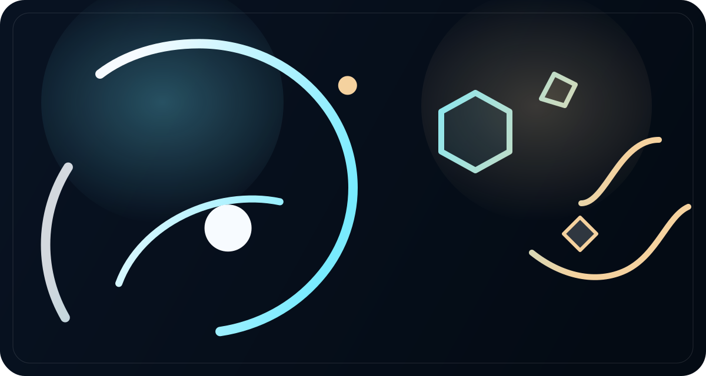

<div align="center">
  
  <h1>SVG Concept Lab</h1>
  <p>
    A growing repository of concept-driven SVG collections built as experiments with the Codex
    <code>frontend-design</code> skill.<br />
    Ritual Glass is the first published set, and the repository is now structured to grow into multiple design concepts.
  </p>
</div>

<p align="center">
  <a href="./README.ja.md"><strong>日本語</strong></a>
</p>

<p align="center">
  
  
  
  
</p>

<p align="center">
  
</p>

> This repository is an experiment repo for the Codex `frontend-design` skill.  
> The SVG designs in the published collections are created with that skill.

## ✨ Overview
This repository is no longer modeled as a single fixed icon drop. It is now organized as a concept lab: a top-level catalog plus one folder per collection. That means future sets can be added without hard-coding every card into the gallery page or rewriting the validation rules around a single icon count.

The current published collection is **Ritual Glass**, a ceremonial set built around orbit lines, prism facets, halos, and quiet light.

## 🧭 Collection Registry
| Slug | Status | Icons | Manifest |
| --- | --- | --- | --- |
| `ritual-glass` | `published` | 10 | [`collections/ritual-glass/collection.json`](./collections/ritual-glass/collection.json) |

The global registry lives at [`collections/manifest.json`](./collections/manifest.json).  
The static site reads that registry and renders collections from data instead of from fixed HTML cards.

## 🚀 Quick Start
Serve the repository locally and open the gallery:

```powershell
uv run python -m http.server 4173
```

Then visit `http://127.0.0.1:4173`.

## 🖼️ Live SVG Preview
<p align="center">
  
  
  
  
  
</p>

<p align="center">
  
  
  
  
  
</p>

<p align="center">
  <sub>The README renders the original SVG assets directly from the current collection folder.</sub>
</p>

## 🧱 Repository Model
- [`collections/manifest.json`](./collections/manifest.json) is the source of truth for which collections are published.
- Each collection lives under `collections/&lt;slug&gt;/` and defines its own metadata in `collection.json`.
- Shared repository assets stay under [`assets`](./assets), while collection-specific icons and checks stay inside each collection folder.
- [`scripts/site-catalog.mjs`](./scripts/site-catalog.mjs) renders the gallery page from manifest data.
- [`scripts/validate-site.mjs`](./scripts/validate-site.mjs) validates registry structure, collection manifests, file existence, and SVG integrity.

## ➕ Add a New Collection
Bootstrap a new collection folder with [`scripts/new-collection.mjs`](./scripts/new-collection.mjs):

```powershell
node .\scripts\new-collection.mjs --slug aurora-arc --name "Aurora Arc" --ja-name "Aurora Arc"
```

Then:

1. Fill in `collections/<slug>/collection.json`.
2. Drop SVG files into `collections/<slug>/icons/` using `NN-kebab-name.svg`.
3. Add optional browser checks to `collections/<slug>/checks/`.
4. Run `node .\scripts\validate-site.mjs`.
5. Preview locally with `uv run python -m http.server 4173`.

## 🛠️ Contributor Checklist
- Use a lowercase hyphenated slug such as `ritual-glass` or `aurora-arc`.
- Name SVG files as `NN-kebab-name.svg`.
- Keep `<svg>`, `viewBox`, and `<title>` in every icon file.
- Update collection copy in both English and Japanese fields inside the manifest.
- Keep the collection registry focused: publish only concept sets that are coherent as a family.

More detailed maintenance notes live in [`CONTRIBUTING.md`](./CONTRIBUTING.md) and [`collections/README.md`](./collections/README.md).

## ✅ Verification
Run the structural validator:

```powershell
node .\scripts\validate-site.mjs
```

This validator confirms:

- required repository files exist
- the collection registry resolves to valid collection manifests
- every published SVG file exists and includes `<svg>`, `viewBox`, and `<title>`
- the static site references the catalog renderer rather than a fixed list of cards
- the bilingual READMEs link to each other and document the collection workflow

You can also smoke-test the scaffold flow in a temporary directory:

```powershell
node .\scripts\smoke-test-collection-flow.mjs
```

## 📁 Repository Layout
```text
.
|-- .github/workflows/
|-- assets/
|   |-- favicon.svg
|   |-- ritual-glass-hero.svg
|   `-- ritual-glass-mark.svg
|-- collections/
|   |-- manifest.json
|   `-- ritual-glass/
|       |-- checks/
|       |-- collection.json
|       `-- icons/
|-- scripts/
|   |-- new-collection.mjs
|   |-- smoke-test-collection-flow.mjs
|   |-- site-catalog.mjs
|   |-- stage-pages.ps1
|   `-- validate-site.mjs
|-- CONTRIBUTING.md
|-- index.html
|-- LICENSE
|-- README.ja.md
|-- README.md
|-- robots.txt
`-- site.webmanifest
```

## 📄 License
This project is released under the [`MIT License`](./LICENSE).
